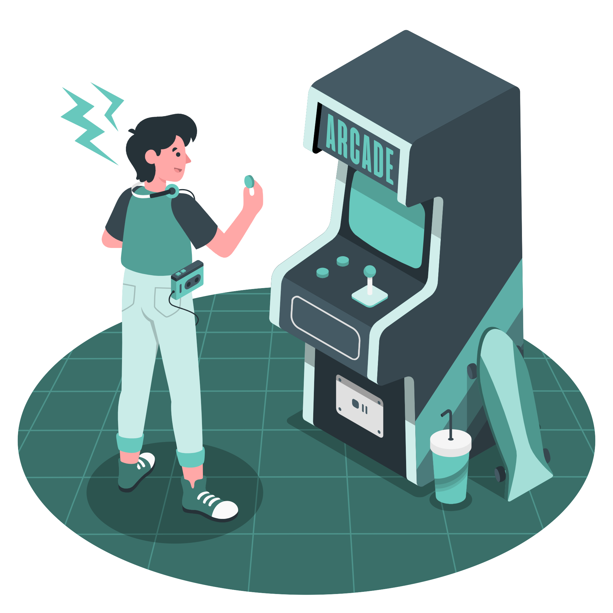
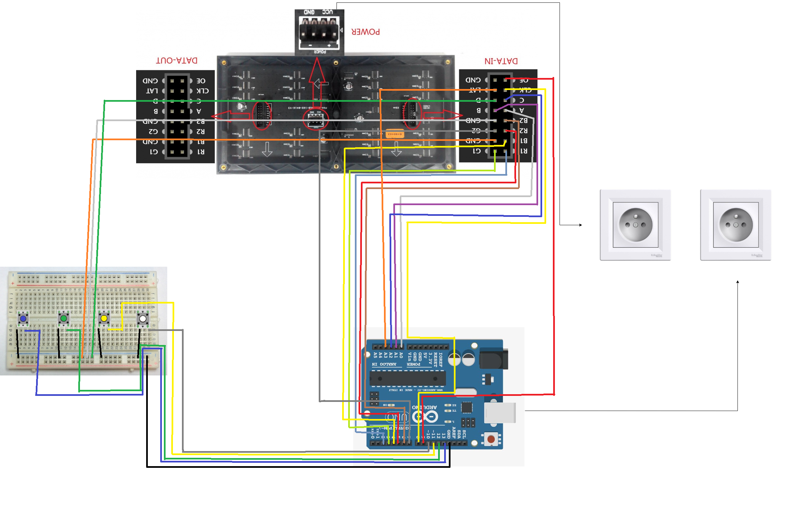
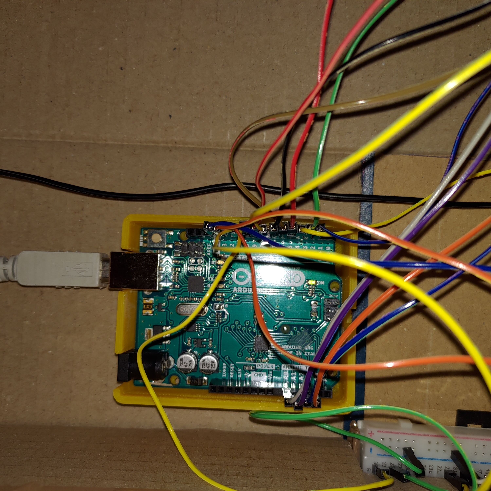
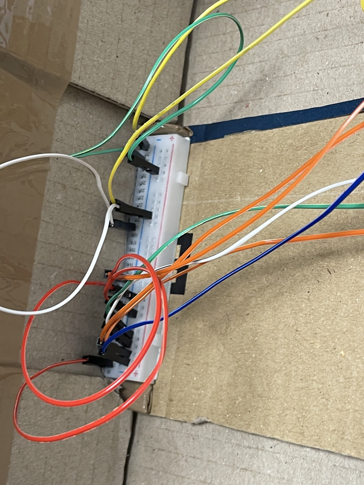
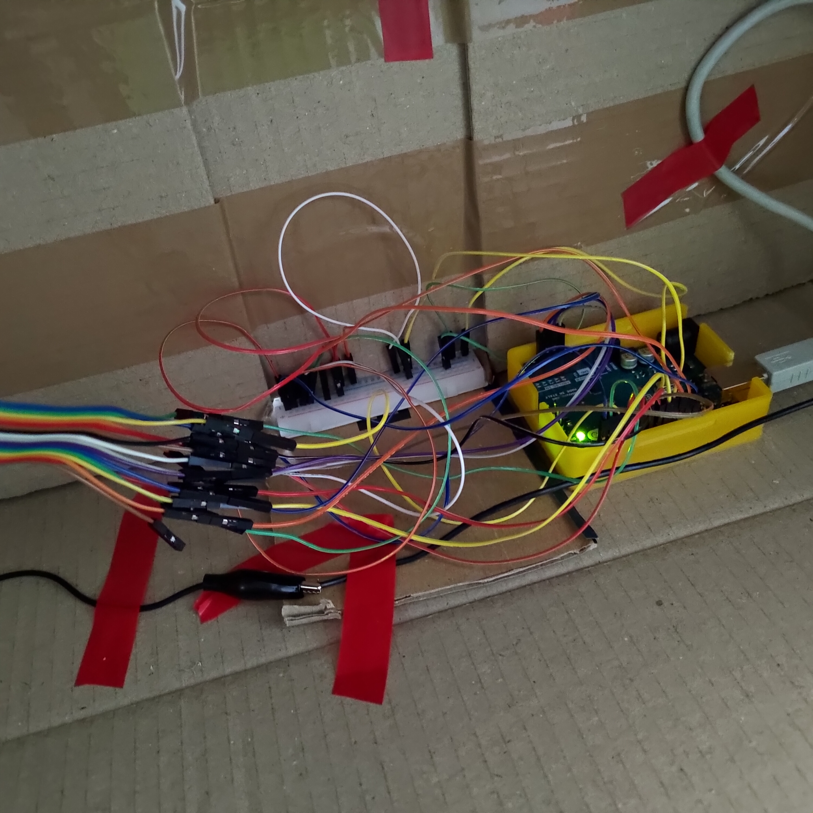
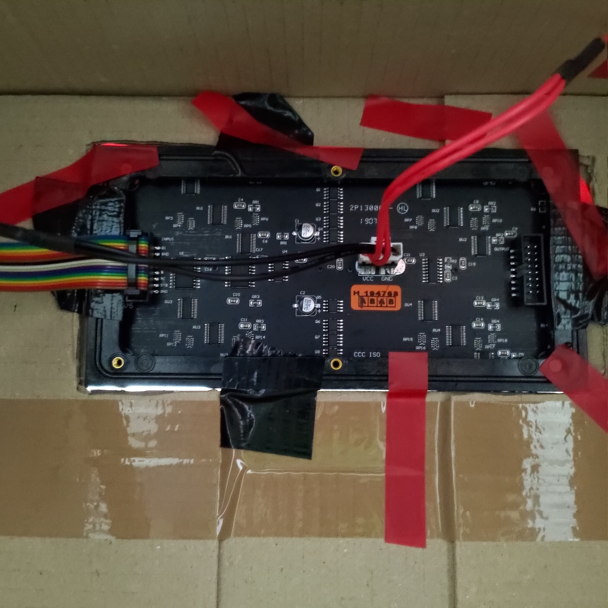
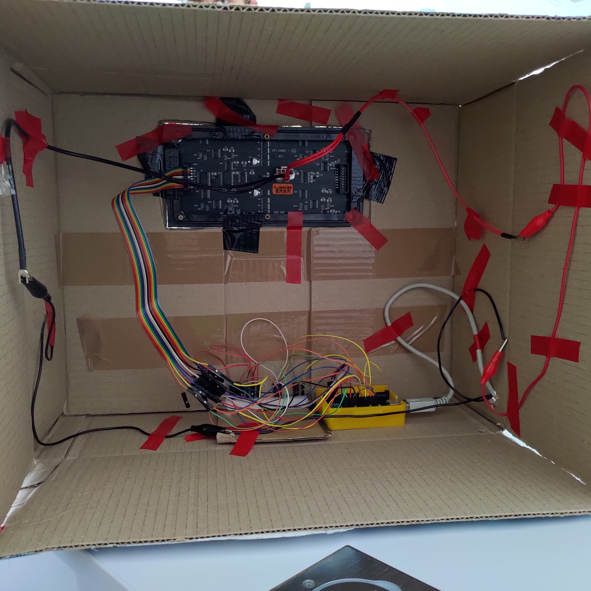

<h1 align="center">
  
  <br>
  <i>SAM-Arduino-matrix</i>
</h1>

SAM est un projet de borne arcade à travers un Arduino ainsi qu'une matrice RGB.
Toutes les images sont disponibles dans le dossier "[images](images)".

# Table des matières

* [Présentation](#présentation)
* [Mise en place](#mise-en-place)
  * [Composants nécessaires](#composants-nécessaires)
  * [Schéma de câblage](#schéma-de-câblage)
  * [Code Arduino](#code-arduino)
    * [Librairies utilisées](#librairies-utilisées)
    * [Algorithme](#algorithme)
* [Sources](#sources)
* [Contributeurs](#contributeurs)

# Présentation


Sam est un jeu de réactivité, l’objectif est de cliquer le plus rapidement possible sur le bouton correspondant à la couleur de l’écran. Attention les couleurs sont affichées de plus en plus vite!

# Mise en place

## Composants nécessaires

Pour ce projet vous avez besoin de : 

*   4 [boutons poussoirs]([https://www.amazon.fr/RUNCCI-YUN-momentan%C3%A9-tactile-Interrupteur-capuchon/dp/B07WPBQXJ9](https://www.amazon.fr/RUNCCI-YUN-momentan%C3%A9-tactile-Interrupteur-capuchon/dp/B07WPBQXJ9)) : bleu, blanc, jaune et vert 
*   1 [Arduino Uno]([https://www.amazon.fr/Arduino-A000066-M%C3%A9moire-flash-32/dp/B008GRTSV6](https://www.amazon.fr/Arduino-A000066-M%C3%A9moire-flash-32/dp/B008GRTSV6))
*   1 [Matrice LED RGB 32x16]([https://www.gotronic.fr/art-matrice-32x16-a-leds-rgb-dfr0471-27853.htm](https://www.gotronic.fr/art-matrice-32x16-a-leds-rgb-dfr0471-27853.htm))

## Schéma de câblage



Arduino                    |  Breadboard              |  Arduino vers Matrice    |  Matrice                 |  Rendu global
:-------------------------:|:------------------------:|:------------------------:|:------------------------:|:------------------------:
     |    |   |   |  

## Code Arduino

### Librairies utilisées

Plusieurs librairies Adafruit :
```md c
#include <Adafruit_BusIO_Register.h>
#include <Adafruit_I2CDevice.h>
#include <Adafruit_I2CRegister.h>
#include <Adafruit_SPIDevice.h>
#include <Adafruit_GFX.h>
```
Libraire [RGBmatrixPanel](https://github.com/adafruit/RGB-matrix-Panel/blob/master/RGBmatrixPanel.h) :
```md c

#include <RGBmatrixPanel.h>
```

### Algorithme

Dans un premier temps, l’écran de début de partie va s’afficher. Lorsqu’un des boutons est appuyé, une partie se lance.
Une couleur aléatoire apparaît alors à l’écran durant un laps de temps de plus en plus court suivant l’avancement de la partie.
Si le bon bouton a été pressé, le score du joueur est incrémenté de 1, la durée d’affichage de la couleur est réduite de 90ms, et une nouvelle couleur apparaît.
Si un mauvais bouton a été pressé, la partie s’arrête en affichant l’écran Game Over, suivi de l’affichage du score du joueur.
Enfin, l’écran de début de partie réapparaît.

La totalité du code est disponible en [cliquant ici](sam.ino).


# Sources

Pour réaliser le câblage, nous nous sommes inspiré de la vidéo Youtube suivante réalisée par [POWER GEN](https://www.youtube.com/channel/UCrWUolRMMtMMjpfQSwQbhhQ) : [https://www.youtube.com/watch?v=1U4DlLN2p44&t=491s](https://www.youtube.com/watch?v=1U4DlLN2p44&t=491s)

Pour apprendre à utiliser la matrice nous avons étudié la fiche technique de [DFRobot](https://www.dfrobot.com/) : [https://wiki.dfrobot.com/32x16_RGB_LED_Matrix_-_6mm_pitch_SKU_DFR0471](https://wiki.dfrobot.com/32x16_RGB_LED_Matrix_-_6mm_pitch_SKU_DFR0471)


# Contributeurs

* Dylan Chesnouard
* Adrien Martineau
* Manon Morille 
* Angéline Toussaint
